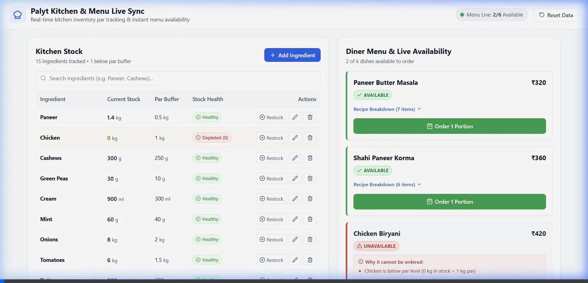

# PR Write-Up: Kitchen Inventory & Menu Live Sync

## A. The Calls I Made

### Data Ambiguities

**Missing stock entries for recipe ingredients.**  
`recipes.json` references Cumin Seeds (Veg Pulao, Jeera Rice) and Refined Flour (Butter Naan), but neither appears in `stock.json`. Rather than silently injecting them with made-up quantities, I treat them as genuinely missing — those dishes show as UNAVAILABLE with "Missing from stock: Cumin Seeds". The user can add them manually if they choose.

**Chicken at zero.**  
Chicken has `qty: 0` and `par: 1`. This is clearly below par, so Chicken Biryani is unavailable from the start. No special handling needed — the general availability rule covers it.

**Mixed units between stock and recipes.**  
Stock stores Paneer as 1.4 kg; recipes require 180 g. I built a unit conversion layer that normalizes compatible units (kg↔g, l↔ml) to a common base before comparison and deduction. The conversion always happens internally — the stock item retains its original unit (kg), and the deduction is converted back (180 g → 0.18 kg subtracted).

### Delete Behavior

If an ingredient is referenced by any recipe, deletion is blocked. The modal names every recipe that uses it. I chose this over cascade-delete (which would corrupt recipes) or soft-delete (which adds complexity beyond the scope). Unreferenced ingredients (Bay Leaves, Saffron in the supplied data) can be deleted freely.

### Par Level Interpretation

I interpret par as the kitchen's safety buffer — the minimum quantity they want on hand before they'll serve dishes with that ingredient. This is checked per-ingredient, not per-portion. If stock ≥ par, the dish is available. If stock < par (even if there's technically enough for one portion), the dish is unavailable.

### Availability is Derived, Not Stored

Menu availability is computed on every render from current stock vs. par levels. There is no separate `isAvailable` flag to maintain or sync. This means editing a par level, restocking, or ordering immediately affects the menu without any extra update logic.

### Demo Video & Screen Recording

---

## B. How I Checked

### Unit Conversion Verification

The test suite explicitly checks:
- `convertToBaseUnit(1.4, 'kg')` → 1400 g
- `convertQuantity(180, 'g', 'kg')` → 0.18
- `convertQuantity(500, 'g', 'ml')` → `null` (incompatible)
- Case/whitespace insensitivity: `' KG '` → works correctly

### Business Logic Tests (23 total, all passing)

**Availability checks:**
- Paneer Butter Masala is available (all ingredients above par) ✓
- Chicken Biryani is unavailable (Chicken is 0 kg, par 1 kg) ✓
- Veg Pulao is unavailable (Cumin Seeds missing from stock) ✓
- Butter Naan is unavailable (Refined Flour missing from stock) ✓

**Order deduction:**
- Ordering Paneer Butter Masala: Paneer goes from 1.4 kg to 1.22 kg (deducted 0.18 kg = 180 g converted), Cashews from 300 g to 285 g ✓
- Two orders of Shahi Paneer Korma deplete Cashews below par (300 → 260 → 220 g, par 250 g) ✓
- Both Shahi Paneer Korma AND Paneer Butter Masala become unavailable when Cashews drops below par (shared ingredient) ✓
- Ordering an unavailable dish is rejected ✓

**Restock:**
- Restocking Chicken to 2 kg makes Chicken Biryani available ✓

**Par level changes:**
- Raising Paneer par from 0.5 to 2.0 (above current 1.4 kg stock) makes Paneer Butter Masala unavailable ✓
- Lowering it back to 1.0 restores availability ✓

**Deletion rules:**
- Bay Leaves and Saffron (unused) → can delete ✓
- Cashews (used by 2 recipes) → blocked, lists both recipe names ✓
- Paneer (used by 2 recipes) → blocked ✓

**Form validation:**
- Empty fields, negative numbers, duplicate names all caught ✓

### Edge Cases Covered

- Floating point: 1.4 × 1000 = 1400 exactly (rounded to avoid IEEE 754 drift)
- Zero quantity: Chicken at 0 correctly triggers below-par
- Shared ingredients: depleting Cashews affects both dishes that use it
- Incompatible units: g vs. ml returns null, dish marked unavailable with reason
- Unknown units: treated as identity (same string = compatible, different string = incompatible)

---

## C. Another Day

If I had more time, I would:

1. **Persist state to localStorage** — so orders and restocks survive page refresh without needing a backend.
2. **Order history log** — show what was ordered, when, and what was deducted. Currently there's no audit trail beyond the notification banner.
3. **Batch ordering** — allow ordering multiple portions or multiple dishes at once, with a single stock deduction pass.
4. **Recipe management UI** — let the kitchen edit recipes (add/remove ingredients, change portions). Currently recipes are read-only from the JSON.
5. **Low-stock alerts / reorder suggestions** — proactively highlight ingredients approaching par level, not just those already below it.
6. **Responsive mobile layout** — the side-by-side layout works on desktop but would benefit from a tabbed view on smaller screens.
7. **Accessibility** — add ARIA labels to all interactive elements, keyboard navigation for the table, and screen reader announcements for order confirmations.
8. **Integration tests** — test the full flow in a browser environment (e.g. with React Testing Library) to verify that clicking "Order" updates the stock table and menu grid together.
